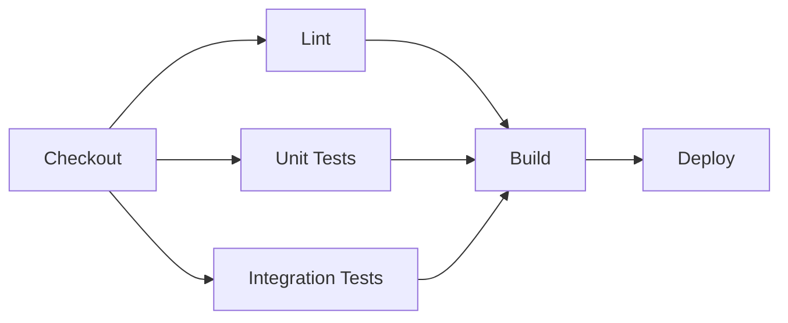

# Pipeline Design

Learn to design CI/CD pipelines that are fast, reliable, and maintainable. Good pipeline design makes the difference between smooth deployments and 3 AM emergency fixes.

## Pipeline Design Principles

### 1. Fail Fast
Catch problems as early as possible in the pipeline:
- **Static analysis first**: Linting, security scans
- **Unit tests early**: Quick feedback on code quality
- **Expensive tests last**: Integration and E2E tests

### 2. Parallel Execution
Run independent jobs concurrently:
- **Test parallelization**: Split test suites across workers
- **Build parallelization**: Build different components simultaneously
- **Environment parallelization**: Deploy to multiple environments

### 3. Pipeline as Code
Version control your pipeline definitions:
- **Declarative syntax**: YAML/JSON configuration files
- **Code review process**: Review pipeline changes like code
- **Branching strategies**: Different pipelines for different branches

### 4. Idempotency
Pipelines should produce the same result when run multiple times:
- **Deterministic builds**: Same inputs = same outputs
- **Environment consistency**: Identical environments every time
- **Database migrations**: Safe to run multiple times

## Pipeline Patterns

### Basic Linear Pipeline


Simple and predictable, but slow for large projects.

### Fan-Out Pattern


Parallel execution for faster feedback.

### Multi-Stage Pipeline


Progressive validation through environments.

### Matrix Builds
Test across multiple configurations:
```yaml
strategy:
  matrix:
    os: [ubuntu-latest, windows-latest, macos-latest]
    node-version: [16, 18, 20]
    include:
      - os: ubuntu-latest
        node-version: 16
        experimental: true
```

## Pipeline Optimization

### Caching Strategies
Speed up builds by caching dependencies:

```yaml
# GitHub Actions caching example
- name: Cache dependencies
  uses: actions/cache@v3
  with:
    path: ~/.npm
    key: ${{ runner.os }}-node-${{ hashFiles('**/package-lock.json') }}
    restore-keys: |
      ${{ runner.os }}-node-
```

### Docker Layer Caching
Optimize Docker builds:
```dockerfile
# Copy package files first (changes less frequently)
COPY package*.json ./
RUN npm ci --only=production

# Copy source code last (changes more frequently)
COPY . .
RUN npm run build
```

### Incremental Testing
Only test what changed:
```bash
# Run tests for changed files only
npm test -- --findRelatedTests $(git diff --name-only HEAD~1)

# Nx workspace with affected projects
nx affected:test --base=HEAD~1
```

## Environment Management

### Environment Promotion
```yaml
environments:
  development:
    auto_deploy: true
    protection_rules: []
  
  staging:
    auto_deploy: false
    protection_rules:
      - required_reviewers: 1
  
  production:
    auto_deploy: false
    protection_rules:
      - required_reviewers: 2
      - restrict_pushes: true
```

### Feature Flags
Control feature rollouts independently of deployments:
```python
# Feature flag example
from feature_flags import is_enabled

def new_checkout_flow():
    if is_enabled("new_checkout", user_id=current_user.id):
        return render_new_checkout()
    else:
        return render_old_checkout()
```

### Environment Variables
Manage configuration across environments:
```yaml
# Pipeline environment variables
env:
  NODE_ENV: production
  DATABASE_URL: ${{ secrets.DATABASE_URL }}
  API_KEY: ${{ secrets.API_KEY }}
```

## Error Handling and Recovery

### Retry Strategies
Handle transient failures:
```yaml
# Retry flaky tests
- name: Run tests
  run: npm test
  retry:
    attempts: 3
    delay: 5s
```

### Rollback Mechanisms
Quick recovery from failed deployments:
```bash
# Blue-green deployment with quick rollback
kubectl patch service myapp -p '{"spec":{"selector":{"version":"blue"}}}'

# Helm rollback
helm rollback myapp 1
```

### Notifications
Alert on pipeline failures:
```yaml
# Slack notification on failure
- name: Notify on failure
  if: failure()
  uses: 8398a7/action-slack@v3
  with:
    status: failure
    text: "Pipeline failed on ${{ github.ref }}"
```

## Security in Pipelines

### Secret Management
Never hardcode secrets:
```yaml
# Use encrypted secrets
- name: Deploy
  env:
    AWS_ACCESS_KEY_ID: ${{ secrets.AWS_ACCESS_KEY_ID }}
    AWS_SECRET_ACCESS_KEY: ${{ secrets.AWS_SECRET_ACCESS_KEY }}
  run: aws deploy create-deployment
```

### Dependency Scanning
Check for vulnerabilities:
```yaml
- name: Security audit
  run: npm audit --audit-level high
  
- name: Dependency check
  uses: dependency-check/Dependency-Check_Action@main
```

### Container Scanning
Scan Docker images:
```yaml
- name: Scan image
  uses: aquasecurity/trivy-action@master
  with:
    image-ref: 'myapp:${{ github.sha }}'
    format: 'sarif'
    output: 'trivy-results.sarif'
```

## Monitoring and Observability

### Pipeline Metrics
Track pipeline performance:
- **Build time**: How long builds take
- **Success rate**: Percentage of successful builds
- **Mean time to recovery**: How quickly issues are fixed
- **Deployment frequency**: How often you deploy

### Pipeline Logs
Structured logging for debugging:
```yaml
- name: Debug info
  run: |
    echo "::group::Environment Info"
    node --version
    npm --version
    echo "::endgroup::"
```

### Build Artifacts
Save important build outputs:
```yaml
- name: Upload coverage reports
  uses: actions/upload-artifact@v3
  with:
    name: coverage-report
    path: coverage/
    retention-days: 30
```

## Real-World Pipeline Examples

### Microservices Monorepo
```yaml
name: Microservices CI/CD
on:
  push:
    branches: [main]

jobs:
  detect-changes:
    runs-on: ubuntu-latest
    outputs:
      services: ${{ steps.changes.outputs.services }}
    steps:
      - uses: dorny/paths-filter@v2
        id: changes
        with:
          filters: |
            user-service:
              - 'services/user-service/**'
            order-service:
              - 'services/order-service/**'

  build-and-test:
    needs: detect-changes
    if: ${{ needs.detect-changes.outputs.services != '[]' }}
    strategy:
      matrix:
        service: ${{ fromJSON(needs.detect-changes.outputs.services) }}
    runs-on: ubuntu-latest
    steps:
      - uses: actions/checkout@v3
      - name: Test ${{ matrix.service }}
        run: |
          cd services/${{ matrix.service }}
          npm test
      - name: Build ${{ matrix.service }}
        run: |
          cd services/${{ matrix.service }}
          docker build -t ${{ matrix.service }}:${{ github.sha }} .
```

### Infrastructure as Code Pipeline
```yaml
name: Terraform
on:
  pull_request:
    paths: ['terraform/**']
  push:
    branches: [main]
    paths: ['terraform/**']

jobs:
  plan:
    runs-on: ubuntu-latest
    steps:
      - uses: actions/checkout@v3
      - uses: hashicorp/setup-terraform@v2
      
      - name: Terraform Format
        run: terraform fmt -check
        
      - name: Terraform Plan
        run: terraform plan -no-color
        
      - name: Comment PR
        if: github.event_name == 'pull_request'
        uses: actions/github-script@v6
        with:
          script: |
            const output = `#### Terraform Plan 📖
            \`\`\`
            ${process.env.PLAN}
            \`\`\`
            `;
            github.rest.issues.createComment({
              issue_number: context.issue.number,
              owner: context.repo.owner,
              repo: context.repo.repo,
              body: output
            })
```

---

*Good pipeline design is an investment in your team's productivity and sanity. Spend time getting it right, and you'll deploy with confidence every time.*
